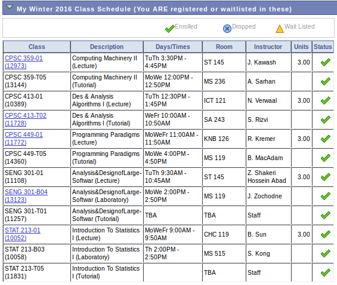

# About

This is a little app I made to make creating Google Calendars, which I use daily, from my UofC schedule, which is impossible to use, a lot easier. Even if I only have to make the conversion twice a year, I was lazy enough to spend a week making this. You can check out the code on [GitHub](https://github.com/blake-mealey/UofC-Schedule-to-Google-Calendar) (first web app, don't judge), as well as the readme for the project which contains information about planned future features/similar projects.

# How to Use

First of all, if you aren't a UofC student with access to your [my.ucalgary.ca](http://my.ucalgary.ca) page, you might as well just leave now. If you're still here, head over to your ucalgary page and then click the "Enroll" button. When you scroll down you should find a table that looks something like this:

*Please don't stalk me*

Now, select all the contents of the table from the top left cell down to the bottom right cell, and copy the text to your clipboard. Come back to this page and paste into the "Course Information" text area. Now, select the options you want. If you choose the semester before selecting a calendar name, it will automatically set it to "_YEAR_ _SEMESTER_ Schedule," but you can change it afterwards if you want. The semester is important because it tells the app when to start and end the events in your calendar. Pick your favourite colours (If you don't like my default selections) and then hit the "Make Calendar" button.

Wait a few seconds while the app creates your calendar then head over to your [Google Calendars](http://calendar.google.com) (or refresh the page if you already had it open) and you should see the calendar in your calendar list. You'll probably have to click on it in the list to make it visible. If it didn't work for any reason, you can feel free to [email me](mailto:blakemealey@gmail.com).

Hope this was helpful and be sure to check out my [actual website](http://blakemealey.ca).